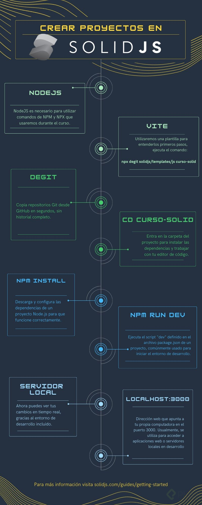

# Curso de SolidJS

## Instalación 



- Instalación plantilla vite con solid:
```npx degit solidjs/templates/js NOMBRE_APP``

## Primitivas

### Signal

Contienen valores que al cambiar actualizaran automáticamente todo aquello que este usando ese valor.
CreateSignal es igual a un useState de React. 
